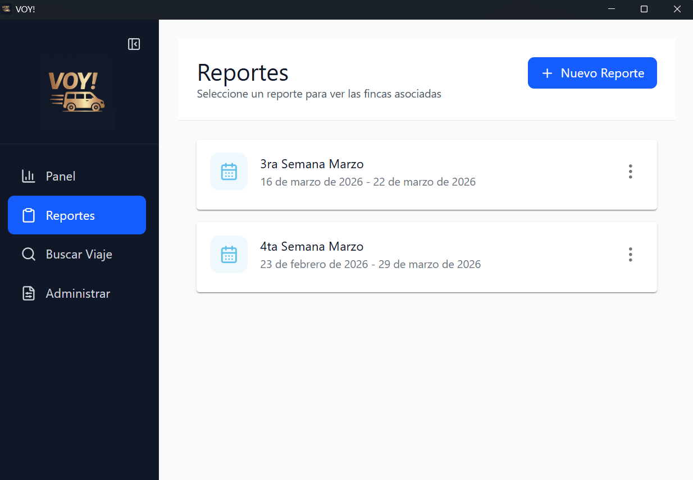
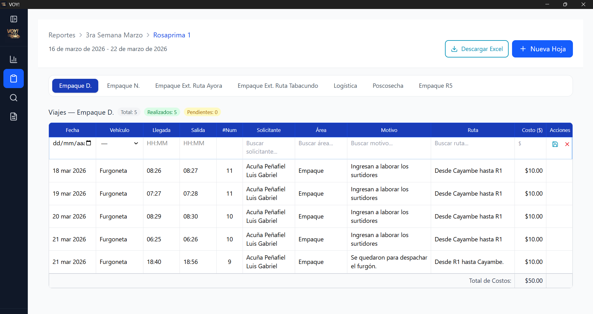
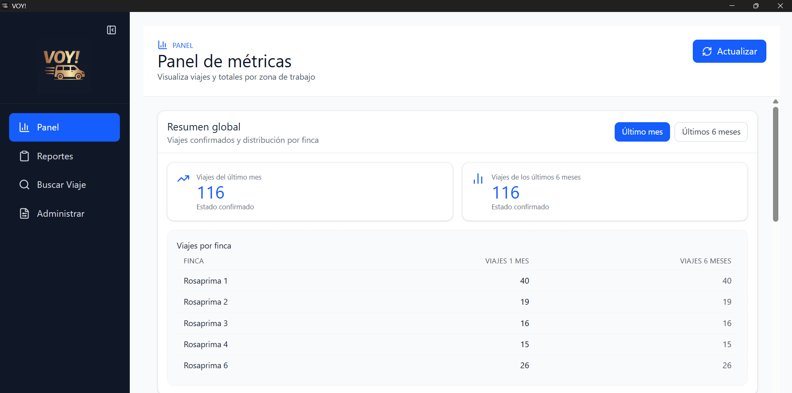
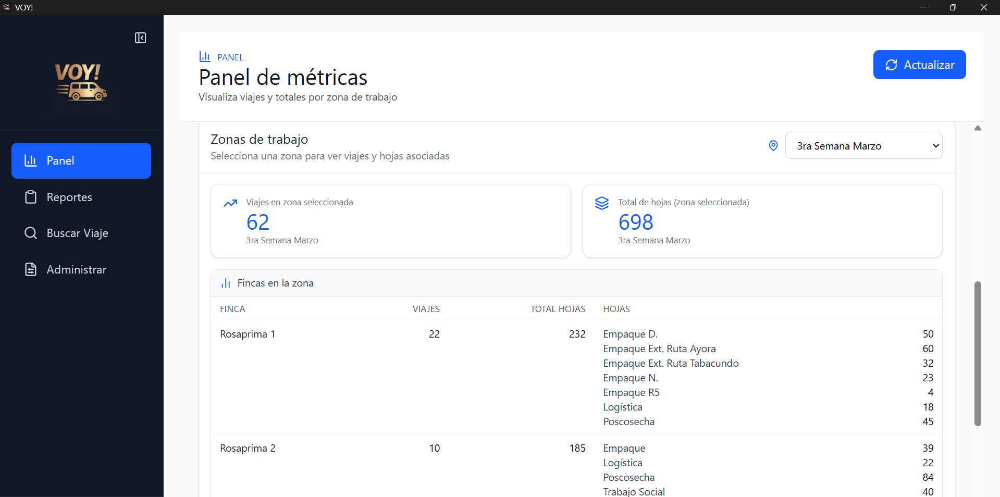
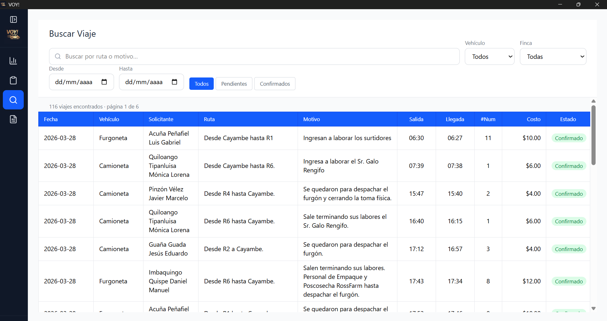
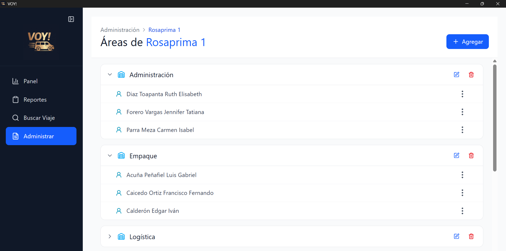

# VOY!

<p align="center">
	
</p>

<p align="center">
	
	
	
	
	
</p>

## Overview

VOY! is a desktop management application built to organize operational data and daily field workflows. It helps managers from Rosaprima's company to centralize records from each trip, track performance, and keep decision-making fast through a simple and reliable desktop experience without the need to have internet connection.

## Features

**Reports:** It allows the registration of each trip organized by farm and respective area. Additionally, each report can be downloaded as an Excel document with Rosaprima's corporate format.

<p align="center">
	
	
</p>

**Metrics:** Visualize the performance of trips for each farm, as well as a summary of the most important indicators in the work zones.

<p align="center">
	
	
</p>

**Search:** Quick filtering to obtain details of a particular type of trip among all records made.

<p align="center">
	
</p>

**Administrate:** Management of registration/editing of data relating to properties, their areas, managers and requesters.

<p align="center">
	
</p>

## Installation (Windows)

You can [download](https://github.com/devdiagon/ya-void/releases/latest) the latest `.exe` installer from the release assets in this repository. Then you need to run the installer and follow the setup steps on your machine.

## Development Setup

Install dependencies:

```bash
pnpm install
```

Run the app in development mode:

```bash
pnpm dev
```

Build the Windows binaries (output will be generated in the `dist` directory):

```bash
pnpm build:win
```

>*Since this is a Windows binary, you MUST run the build command from a terminal opened as Administrator to avoid permission issues while generating artifacts.*